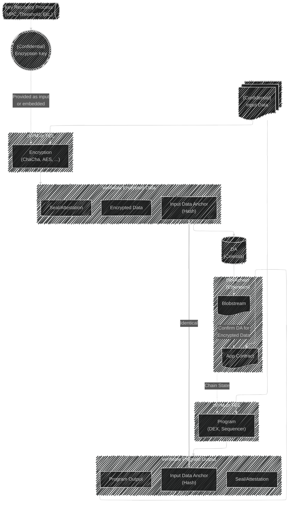

# Private DA Middleware Proxy

> ⚠
> **_NOTICE_**
> Work in Progress!
> NOT ready for use!/
> ⚠

### TODO

- [ ] `blob.Submit` encrypts before proxy submission
- [ ] `blob.Get` proxy result is decrypted before responding
- [ ] `state.Balance` & `state.AccountAddress` & `state.Transfer` passthrough proxy
- [ ] Fully compliant passthrough proxy for all non-encrypted data API calls (more than `Blob` and `State`?)

---

A [Celestia](https://celestia.org) client for the [`Blob` and `State` JSON RPC namespaces](https://node-rpc-docs.celestia.org/) enabling sensitive data to be **_verifiably encrypted_** before submission on the (public) network, and enable decryption on retrieval.
Non-sensitive calls are unmodified.

Verifiable encryption is enabled via an [SP1 Zero Knowledge Proof (ZKP)](https://docs.succinct.xyz/docs/sp1/what-is-a-zkvm).

**Jump to a section:**

- Send requests this service: [Interact](#interact)
- Spin up an instance of the service: [Operate](#operate)
- Build & troubleshoot: [Develop](#develop)

## Known Limitations

At time of writing, as it should be possible to change these limitations:

- Assumes that there is a single blob per transaction, no logic to handle multiple blobs.
- Verifiable Encryption is **_one-at-a-time_**, and takes **_minutes to complete each request_**.
  - If the service is processing a job, it will respond with `busy` and (may?) add that to a queue.
  - {Other proxy calls should still be responsive}

Possible to change these, but requires upstream involvement:

- [Max blob size on Celestia](https://docs.celestia.org/how-to-guides/submit-data#maximum-blob-size) is presently ~2MB
- Upstream jsonrpsee en/decryption middleware feature into lumina?

## Architecture



The PDA proxy depends on a connection to:

1. Celestia Data Availability (DA) Node to:
   - Submit and retrieve (verifiable encrypted) blob data.
1. (Optional) [Succinct prover network](https://docs.succinct.xyz/docs/sp1/generating-proofs/prover-network) as a provider to generate Zero-Knowledge Proofs (ZKPs) of data existing on Celestia.
   _See the [ZKP program](./zkVM/sp1/program-chacha) for details on what is proven._

## Interact

First you need to [configure](#configure) your environment and nodes.

Then any HTTP1 client works to send [Celestial JSON RPC](https://docs.celestia.org/how-to-guides/submit-data#submitting-data-blobs-to-celestia) calls to the proxy:

```sh
# Proxy running on 127.0.0.1:26657
# See: <https://mocha.celenium.io/blob?commitment=S2iIifIPdAjQ33KPeyfAga26FSF3IL11WsCGtJKSOTA=&hash=AAAAAAAAAAAAAAAAAAAAAAAAAFHMGnPWX5X2veY=&height=4499999>

source .env
# blob.Get
curl -H "Content-Type: application/json" -H "Authorization: Bearer $CELESTIA_NODE_WRITE_TOKEN" -X POST \
     --data '{ "id": 1, "jsonrpc": "2.0", "method": "blob.Get", "params": [ 4499999, "AAAAAAAAAAAAAAAAAAAAAAAAAFHMGnPWX5X2veY=", "S2iIifIPdAjQ33KPeyfAga26FSF3IL11WsCGtJKSOTA="] }' \
     127.0.0.1:26657
# blob.GetAll
curl -H "Content-Type: application/json" -H "Authorization: Bearer $CELESTIA_NODE_WRITE_TOKEN" -X POST \
     --data '{ "id": 1, "jsonrpc": "2.0", "method": "blob.GetAll", "params": [ 4499999, [ "AAAAAAAAAAAAAAAAAAAAAAAAAFHMGnPWX5X2veY=" ] ] }' \
     127.0.0.1:26657
# blob.Submit
# Note: send "{}" as empty `tx_config` object, so the node uses it's default key to sign & submit to Celestia
# Also for testing we explicitly allow --insecure
curl -H "Content-Type: application/json" -H "Authorization: Bearer $CELESTIA_NODE_WRITE_TOKEN" -X POST \
     --data '{ "id": 1, "jsonrpc": "2.0", "method": "blob.Submit", "params": [ [ { "namespace": "AAAAAAAAAAAAAAAAAAAAAAAAAAAAAMJ/xGlNMdE=", "data": "DEADB33F", "share_version": 0, "commitment": "aHlbp+J9yub6hw/uhK6dP8hBLR2mFy78XNRRdLf2794=", "index": -1 } ], { } ] }' \
     https://127.0.0.1:26657 \
     --insecure -v
    # ^^^^ DO NOT use insecure TLS in real scenarios!
```

Celestia has many [API client libraries](https://docs.celestia.org/how-to-guides/submit-data#api) to build around a PDA proxy.

## Operate

**_TODO: notice on single job at a time_**

- single GPU 100% used per job
- presently no way to scale on multi-GPU

Most users will want to pull and run this service using Docker or Podman via container registry, see [running containers](#running-containers).

To build and run, see [developing instructions](#develop)

### Requirements

TODO

1. A machine to run with a _minimum_ of:

   - L4 NVIDIA GPU
   - GB RAM
   - Ports accessible (by default):
     - service listening at `TODO`
     - Light client (local or remote) over `26658`
     - (Optional) Succinct prover network over `443`

1. A whitelisted key in your `env` for use with the Succinct prover network Key - [requested here](https://docs.succinct.xyz/docs/sp1/generating-proofs/prover-network).

1. A Celestia Light Node [installed](https://docs.celestia.org/how-to-guides/celestia-node) & [running](https://docs.celestia.org/tutorials/node-tutorial#auth-token) accessible on `localhost`, or elsewhere.
   Alternatively, use [an RPC provider](https://github.com/celestiaorg/awesome-celestia/?tab=readme-ov-file#node-operator-contributions) you trust.
   - [Configure and fund a Celestia Wallet](https://docs.celestia.org/tutorials/celestia-node-key#create-a-wallet-with-celestia-node) for the node to sign and send transactions with.
   - [Generate and set a node JWT with `write` permissions](https://docs.celestia.org/how-to-guides/quick-start#get-your-auth-token) and set in `.env` for the proxy to use.

### Configure

Required and optional settings are best configured via a `.env` file. See [`example.env`](./example.env) for configurable items.

```sh
cp example.env .env

# edit .env
```

### Using containers

The images are available:

TODO

```sh
# ghcr:
docker pull ghcr.io/celestiaorg/pda-proxy:latest

# Docker hub:
docker pull celestiaorg/pda-proxy:latest
```

_Don't forget you need to [configure your environment](#configure)_.

#### Setup Host

As we don't want to embed huge files, secrets, and dev only example static files, you will need to place them on the host machine in the following paths:

1. Create or use `scp` to copy a known good `.env` to `/app/.env` on the host machine (see [config](#configure).
1. Setup a DNS to point to your instance, update `.env` with email and domain
1. Run [./scripts/setup_lets_encrypt.sh](./scripts/setup_lets_encrypt.sh) or otherwise configure TLS certs & keys.
   1. **ONLY for testing!** copy the unsafe example TLS files from [./service/static](./service/static) to `app/static` on the host
      - You should use:
      ```sh
      TLS_CERTS_PATH=/app/static/sample.pem
      TLS_KEY_PATH=/app/static/sample.rsa
      ```
1. Run [./scripts/init_celestia_docker.sh](./scripts/init_celestia_docker.sh) to initialize a local Celestia Node with persistent storage.
   - Update `.env` to use the correct `CELESTIA_NODE_WRITE_TOKEN`

#### Running containers

With the [correct setup of the host](#setup-host), you can startup both the proxy and local celestia node with:

```sh
docker compose --env-file /app/.env up -d
```

Or manually just the proxy itself:

```sh
just docker-run
```

## Develop

First, some tooling is required:

1. Rust & Cargo - [install instructions](https://www.rust-lang.org/tools/install)
1. SP1 zkVM Toolchain - [install instructions](https://docs.succinct.xyz/docs/sp1/getting-started/install)
1. Protocol Buffers (Protobuf) compiler - [official examples](https://github.com/hyperium/tonic/tree/master/examples#examples) contain install instructions
1. (Optional) Just - a modern alternative to `make` [installed](https://just.systems/man/en/packages.html)
1. NVIDIA compiler & container toolkit <https://docs.succinct.xyz/docs/sp1/generating-proofs/hardware-acceleration#software-requirements>

Then:

1. Clone the repo

   ```sh
   git clone https://github.com/your-repo-name/pda-proxy.git
   cd pda-proxy
   ```

1. Choose a Celestia Node

   - See the [How-to-guides on nodes](https://docs.celestia.org/how-to-guides/light-node) to run one yourself, or choose a provider & set in `env`.
   - **NOTE:** You _must_ have the node synced back to the oldest possible height you may encounter in calling this service for it to fulfill that request.

1. [Configure required env variables](#configure)

1. Build and run the service
   ```sh
   # NOT optimized, default includes debug logs printed
   just run-debug
   # Optimized build, to test realistic performance w/ INFO logs
   just run-release
   ```

There are many other helper scripts exposed in the [justfile](./justfile), get a list with:

```
# Print just recipes
just
```

### Containerization

Docker and [Podman](https://podman.io/) are configured in [Dockerfile](./Dockerfile) to build an image with that includes a few caching layers to minimize development time & final image size -> publish where possible. To build and run in a container:

```sh
# Using just
just docker-build
just docker-run


# Manually

## Build
[docker|podman] build -t eq_service .

## Setup
source .env
mkdir -p $PDA_DB_PATH

## Run (example)
[docker|podman] run --rm -it -v $PDA_DB_PATH:$PDA_DB_PATH --env-file .env --env RUST_LOG=eq_service=debug --network=host -p $PDA_PORT:$PDA_PORT pda_proxy
```

Importantly, the DB should persist, and the container must have access to connect to the DA light client (likely port 26658) and Succinct network ports (HTTPS over 443).

The images are built and published for [releases](https://github.com/celestiaorg/eq-service/releases) - see [running containers](#running-containers) for how to pull them.

## License

[MIT License](./LICENSE)

## Acknowledgments

Based heavily on:

- <https://github.com/paritytech/jsonrpsee/blob/master/examples/examples/proc_macro.rs>
- <https://github.com/eigerco/lumina/tree/main/rpc>
