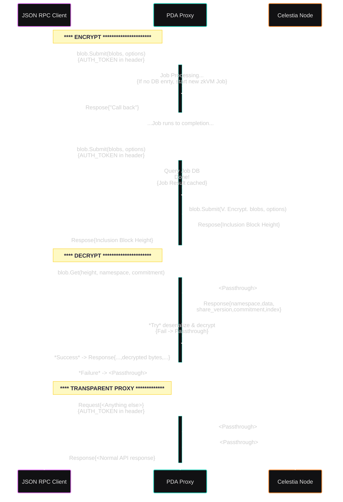

# Private Data Availability Proxy

A [Celestia Data Availability (DA)](https://celestia.org) proxy, enabling use of the [canonical JSON RPC](https://node-rpc-docs.celestia.org/) but intercepting and [**_verifiably_** encrypting](./doc/verifiable_encryption.md) sensitive data before submission on the public DA network, and enable decryption on retrieval.
Non-sensitive calls are unmodified.

Verifiable encryption is presently enabled via an [SP1 Zero Knowledge Proof (ZKP)](https://docs.succinct.xyz/docs/sp1/what-is-a-zkvm), with [additional proof systems planned](./doc/verifiable_encryption.md)

**Jump to a section:**

- Send requests this service: [Interact](#interact)
- Spin up an instance of the service: [Operate](#operate)
- Build & troubleshoot: [Develop](#develop)

## Known Limitations

Presently all HTTP requests to the proxy are transparently proxied to an upstream Celestia node, interception logic handles these JSON RPC methods:

- (complete) `blob.Submit` encrypts before proxy submission
- (not implemented)`blob.Get` proxy result is decrypted before responding

At time of writing, as it should be possible to change these limitations internally:

- [ ] https://github.com/celestiaorg/pda-proxy/issues/11
- [ ] https://github.com/celestiaorg/pda-proxy/issues/12

It's possible to change these, but requires upstream involvement:

- [Max blob size on Celestia](https://docs.celestia.org/how-to-guides/submit-data#maximum-blob-size) is presently ~2MB
- Upstream jsonrpsee en/decryption middleware feature into lumina Rust client?

> Please [open an issue](https://github.com/celestiaorg/pda-proxy/issues) if you have any requests!

## Architecture


The PDA proxy depends on a connection to:

1. Celestia Data Availability (DA) Node to:
   - Submit and retrieve (verifiable encrypted) blob data.
1. (Optional) [Succinct prover network](https://docs.succinct.xyz/docs/sp1/generating-proofs/prover-network) as a provider to generate Zero-Knowledge Proofs (ZKPs) of data existing on Celestia.
   _See the [ZKP program](./zkVM/sp1/program-chacha) for details on what is proven._

## Interact



First you need to [configure](#configure) your environment and nodes.

Then any HTTP1 client works to send [Celestial JSON RPC](https://docs.celestia.org/how-to-guides/submit-data#submitting-data-blobs-to-celestia) calls to the proxy:

```sh
# Proxy running on 127.0.0.1:26657
# See: <https://mocha.celenium.io/blob?commitment=S2iIifIPdAjQ33KPeyfAga26FSF3IL11WsCGtJKSOTA=&hash=AAAAAAAAAAAAAAAAAAAAAAAAAFHMGnPWX5X2veY=&height=4499999>

source .env
# blob.Get
curl -H "Content-Type: application/json" -H "Authorization: Bearer $CELESTIA_NODE_WRITE_TOKEN" -X POST \
     --data '{ "id": 1, "jsonrpc": "2.0", "method": "blob.Get", "params": [ 4499999, "AAAAAAAAAAAAAAAAAAAAAAAAAFHMGnPWX5X2veY=", "S2iIifIPdAjQ33KPeyfAga26FSF3IL11WsCGtJKSOTA="] }' \
     $PDA_SOCKET
# blob.GetAll
curl -H "Content-Type: application/json" -H "Authorization: Bearer $CELESTIA_NODE_WRITE_TOKEN" -X POST \
     --data '{ "id": 1, "jsonrpc": "2.0", "method": "blob.GetAll", "params": [ 4499999, [ "AAAAAAAAAAAAAAAAAAAAAAAAAFHMGnPWX5X2veY=" ] ] }' \
     $PDA_SOCKET
# blob.Submit (dummy data)
# Note: send "{}" as empty `tx_config` object, so the node uses it's default key to sign & submit to Celestia
curl -H "Content-Type: application/json" -H "Authorization: Bearer $CELESTIA_NODE_WRITE_TOKEN" -X POST \
     --data '{ "id": 1, "jsonrpc": "2.0", "method": "blob.Submit", "params": [ [ { "namespace": "AAAAAAAAAAAAAAAAAAAAAAAAAAAAAMJ/xGlNMdE=", "data": "DEADB33F", "share_version": 0, "commitment": "aHlbp+J9yub6hw/uhK6dP8hBLR2mFy78XNRRdLf2794=", "index": -1 } ], { } ] }' \
     https://$PDA_SOCKET \
     --verbose \
     --insecure
    # ^^^^ DO NOT use insecure TLS in real scenarios!
# blob.Submit (example input ~1.5MB)
cd scripts
./test_example_data_file_via_curl.sh
```

Celestia has many [API client libraries](https://docs.celestia.org/how-to-guides/submit-data#api) to build around a PDA proxy.

## Operate

**_TODO: notice on single job at a time_**

- single GPU 100% used per job
- presently no way to scale on multi-GPU

Most users will want to pull and run this service using Docker or Podman via container registry, see [running containers](#running-containers).

To build and run, see [developing instructions](#develop)

### Requirements

TODO

1. A machine to run with a _minimum_ of:

   - L4 NVIDIA GPU
   - GB RAM
   - Ports accessible (by default):
     - service listening at `TODO`
     - Light client (local or remote) over `26658`
     - (Optional) Succinct prover network over `443`

   Example AWS instance: [g6.xlarge (single L4 GPU + 8 vCPU)](https://aws.amazon.com/ec2/instance-types/g6/)

1. A Celestia Light Node [installed](https://docs.celestia.org/how-to-guides/celestia-node) & [running](https://docs.celestia.org/tutorials/node-tutorial#auth-token) accessible on `localhost`, or elsewhere.
   Alternatively, use [an RPC provider](https://github.com/celestiaorg/awesome-celestia/?tab=readme-ov-file#node-operator-contributions) you trust.
   - [Configure and fund a Celestia Wallet](https://docs.celestia.org/tutorials/celestia-node-key#create-a-wallet-with-celestia-node) for the node to sign and send transactions with.
   - [Generate and set a node JWT with `write` permissions](https://docs.celestia.org/how-to-guides/quick-start#get-your-auth-token) and set in `.env` for the proxy to use.

### Configure

**_Required_** and optional settings are best configured via a `.env` file. See [`example.env`](./example.env) for configurable items.

```sh
cp example.env .env

# edit .env
```

### Using containers

The images are available:

```sh
# ghcr:
docker pull ghcr.io/celestiaorg/pda-proxy

# Docker hub:
docker pull celestiaorg/pda-proxy
```

_Don't forget you need to [configure your environment](#configure)_.

#### Setup Host

As we don't want to embed huge files, secrets, and dev only example static files, you will need to place them on the host machine in the following paths:

1. Setup a DNS to point to your instance with email and domain.
1. Create and update an `.env` (see [config](#configure).
1. Run [./scripts/setup_remote_host.sh](./scripts/setup_remote_host.sh) or otherwise see the scripts to manually configure similarly.
   1. **ONLY for development & testing!** copy the unsafe example TLS files from [./service/static](./service/static) to `app/static` on the host
      - You should use:
      ```sh
      TLS_CERTS_PATH=/app/static/sample.pem
      TLS_KEY_PATH=/app/static/sample.rsa
      ```

Note that scripts run on the host update the `/app/.env` file with specific settings for the Celestia node.
Logs will print **very important information** please read those carefully.

#### Running containers

With a [correct setup of the host](#setup-host), you can startup both the proxy and local celestia node with:

```sh
docker compose --env-file /app/.env up -d
```

Or manually just the proxy itself:

```sh
# if you are developing from this repo:
just docker-run

# If you are only running:
source .env
mkdir -p $PDA_DB_PATH
# Note socket assumes running "normally" with docker managed by root
docker run --rm -it \
  --user $(id -u):$(id -g) \
  -v /var/run/docker.sock:/var/run/docker.sock \
 -v $PDA_DB_PATH:$PDA_DB_PATH \
  --env-file {{ env-settings }} \
  --env RUST_LOG=pda_proxy=debug \
  --network=host \
  -p $PDA_PORT:$PDA_PORT \
  "$DOCKER_CONTAINER_NAME"
```

## Develop

First, some tooling is required:

1. Rust & Cargo - [install instructions](https://www.rust-lang.org/tools/install)
1. SP1 zkVM Toolchain - [install instructions](https://docs.succinct.xyz/docs/sp1/getting-started/install)
1. Protocol Buffers (Protobuf) compiler - [official examples](https://github.com/hyperium/tonic/tree/master/examples#examples) contain install instructions
1. (Optional) Just - a modern alternative to `make` [installed](https://just.systems/man/en/packages.html)
1. NVIDIA compiler & container toolkit <https://docs.succinct.xyz/docs/sp1/generating-proofs/hardware-acceleration#software-requirements>

Then:

1. Clone the repo

   ```sh
   git clone https://github.com/your-repo-name/pda-proxy.git
   cd pda-proxy
   ```

1. Choose a Celestia Node

   - See the [How-to-guides on nodes](https://docs.celestia.org/how-to-guides/light-node) to run one yourself, or choose a provider & set in `env`.
   - **NOTE:** You _must_ have the node synced back to the oldest possible height you may encounter in calling this service for it to fulfill that request.

1. [Configure required env variables](#configure)

1. Build and run the service
   ```sh
   # NOT optimized, default includes debug logs printed
   just run-debug
   # Optimized build, to test realistic performance w/ INFO logs
   just run-release
   ```

There are many other helper scripts exposed in the [justfile](./justfile), get a list with:

```
# Print just recipes
just
```

### Containerization

Docker and [Podman](https://podman.io/) are configured in [Dockerfile](./Dockerfile) to build an image with that includes a few caching layers to minimize development time & final image size -> publish where possible. To build and run in a container:

```sh
# Using just
just docker-build
just docker-run

# Manually

## Build
[docker|podman] build -t eq_service .

## Setup
source .env
mkdir -p $PDA_DB_PATH

## Run (example)
[docker|podman] run --rm -it -v $PDA_DB_PATH:$PDA_DB_PATH --env-file .env --env RUST_LOG=eq_service=debug --network=host -p $PDA_PORT:$PDA_PORT pda_proxy
```

Importantly, the DB should persist, and the container must have access to connect to the DA light client (likely port 26658) and Succinct network ports (HTTPS over 443).

The images are built and published for [releases](https://github.com/celestiaorg/eq-service/releases) - see [running containers](#running-containers) for how to pull them.

## License

[MIT License](./LICENSE)

## Acknowledgments

Based heavily on:

- <https://github.com/eigerco/lumina/tree/main/rpc>
- <https://github.com/celestiaorg/eq-service>
