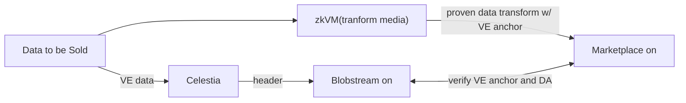

# Verifiable Encryption

### _A New Primitive Empowering Private Data Availability_

> “Don’t trust. Verify.”

This document introduces **Verifiable Encryption (VE)** and explores how it enables **Private Data Availability (PDA)** - a transformative new primitive for secure, decentralized systems.

## Verifiable Encryption

Traditional encryption ensures that ciphertext reveals **nothing** about the underlying plaintext.
This guarantees privacy, but at a cost: **you can’t verify anything about the data without decrypting it**.

This creates a trust bottleneck - **you must fully trust those who hold decryption keys** to act honestly.
But what if we could shift some of that trust to verification?

**Verifiable Encryption (VE)** makes this possible.
By introducing constraints on:

- the plaintext,
- the encryption algorithm,
- and the keys used,

VE allows **public verifiability** of claims about the data **without decrypting it**.
That means anyone can check that encrypted data meets specific criteria - without learning what that data is.

## Data Availability

Many protocols rely on **Data Availability (DA)** for safety and liveness guarantees.
In adversarial conditions - such as censorship or outages - it is critical that data be **publicly available**.

However, not all data should be exposed to the world.

Some datasets are **too sensitive** for full transparency.
The challenge: **How can we ensure critical data is available, yet only selectively disclosed under prearranged conditions**?

## The Power of VE + PDA

By combining **Verifiable Encryption** with **Private Data Availability**, we unlock a powerful new primitive: **auditable yet private data**.

With integration into **existing or novel Key Management Systems (KMS)**, VE allows one to define:

- **who can access** decryption keys,
- **under what conditions**,
- and **what can be verified** without access.

This means:

- Anyone (users, smart contracts, off-chain agents) can verify that encrypted data is available and satisfies certain properties.
- Only authorized parties can decrypt and access the sensitive contents.

## Use Cases

We’ve outlined a few use cases below - but would love to hear your ideas too!
💡 [Open an issue](https://github.com/celestiaorg/pda-proxy/issues) to share feature requests or novel applications of VE and PDA.

### _Programmable Privacy for Web3 dApps_

VE and PDA align closely with the principles of [local-first access control](https://www.inkandswitch.com/keyhive/notebook/), enabling **secure collaboration** across decentralized applications.

In a world where chain data is globally replicated and indexed, **encryption at rest** becomes essential for access control and selective disclosure.

#### Example Applications

- **PDA as a database** for collaborative dApps with fine-grained access control.
- **Private rollups** with programmable cryptography, enabling [obfuscated state](https://0xparc.org/blog/programmable-cryptography-1).
- **Private bridging and escrow** sending verifibly correctm but private messages around web2 and/or web3 apps.
- **Drop-in support** for existing DA users via a [proxy service](../README.md), simplifying migration to PDA.

### _Trustless Data Markets_

With VE, PDA, and escrow contracts you can construct protocols to build trustless exchange of data access
See the [Stock0](https://dorahacks.io/buidl/14098) media market hackathon project for some great inspiration!

Here is a [diagram inspired by them](https://docs.google.com/presentation/d/1qq1QXSBcThOjaQ2OcEyS8cwNyAHs3SnC76YrBMAYENk) of an example setup of inputs for a market:

### _Verifiable Private Backups_

> NOTE: Celestia does _not_ guarantee that data will be avalible forever!
> See [the docs on retrievability](https://docs.celestia.org/learn/retrievability#data-retrievability-and-pruning-in-celestia-node) for the latest safe assumptions to use.

With PDA, sensitive data can be publicly published in encrypted form, with **predefined methods for recovery** - without revealing its contents.

This unlocks a new class of **verifiable, resilient backups**.

#### Example Applications

- **Auditable storage**: Confidential datasets can be verified to exist and be recoverable, while remaining hidden from the public.

- **Disaster recovery**: Critical encrypted data is guaranteed to be retrievable using known decryption methods, ensuring survivability without sacrificing privacy.

## Example Architecture

The **anchor** acts as a bridge, connecting **any protocol** to a **proof** that some _private_ data was made available.

## Future Work and Research Directions

While VE for PDA is still evolving, the potential is enormous.
Current implementations have limitations, but these are rapidly being addressed by:

- Enabling performance improvements, **confidential compute**, and **scalable parallelization** of PDA workflows.
- **Hybrid systems** combining:
  - Trusted Execution Environments (TEEs),
  - Multi-Party Computation (MPC),
  - and Zero-Knowledge Proofs (ZKPs),

For deeper insights, see our ongoing [research discussion here](https://docs.google.com/document/d/1XZyuOxdMm5INcHwQZOZ8ALRk_YkvicNwQHSfOVs8hoM/).
